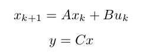
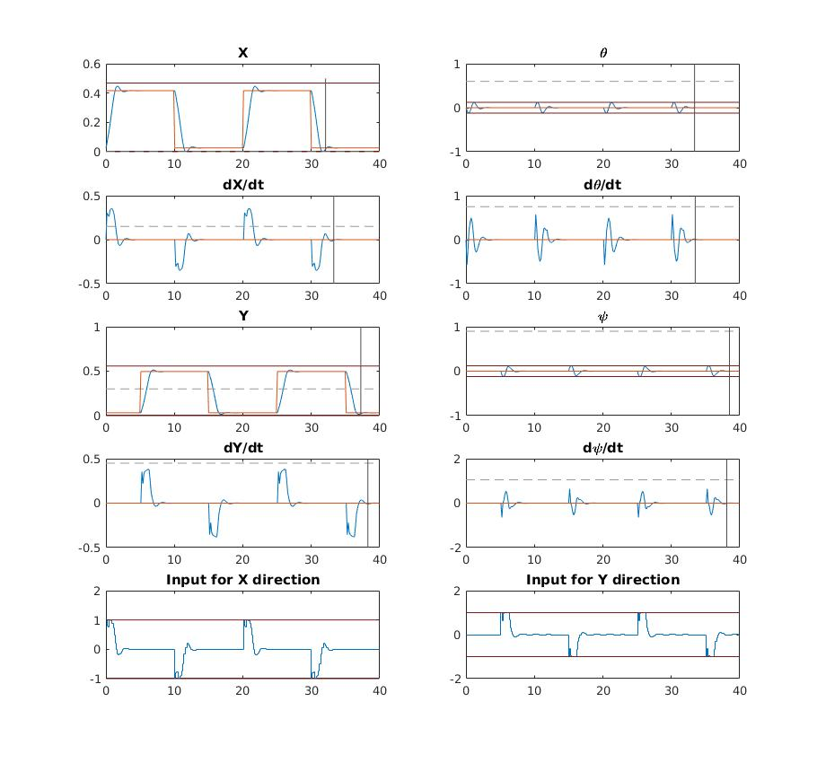
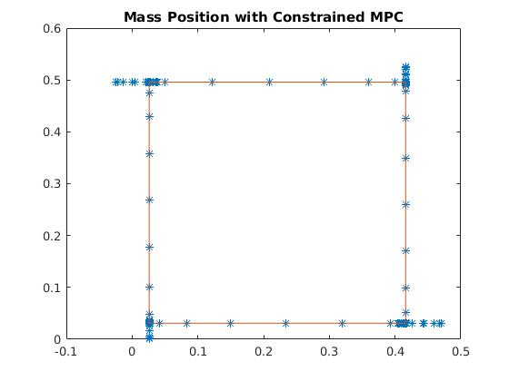

# Crane example of MPC

This is an Matlab implementation on MPC control with both hard and soft constraints on a crane-model. The Crane is modelled in a simulink model.


## Installation

The code is tested in Matlab, 2015 and 2017a.

In matlab 2017a, you have to comment out the function hString2Char in mpqpsolverOptions.m, to make the Simulink model compile. Line 42 in mpqpsolverOptions.m.


## Usage
clone this repository

```
git clone git@github.com:Olofforsberg/RHC-and-MPC-on-a-pendulum-crane-example..git
```
Add this folder to path in matlab and run the files:
testMyRHC.m for running a RHC controller of the crane.
testMyMPC.m for running the extended MPC controller, there is two simulinkmodels for either hard or soft constraints.

## Code structure

Parameters for the ODE equation on a pendulum is stored in SSmodelParams.mat
The simulink model of a crane has parameters stored in the Params_Simscape.mat file.



The discrete State Space model are derived from the equations of a pendulum in CraneODE.m

The referense signal to steer the state towards is callculated to be a rectangle by four points. The reference signal can either be made as a step function towards these points or as a ramp function towards the next corner in the rectangle. The reference signal is calculated in:

File: rectsignal.m for the step function between rectangular corners.
File: rampsignal.m for the ramp function between rectangular corners. 

the Constraints is structured as:
For the stage constraints - StageConstraints.m
For the trajectory constraints - TrajectoryConstraints.m
The output of both is use to compute the Cost Matrices to be used in the QP solver. The cost matrices is calculated in CostMatrices.m

Last to use soft constrained version of MPC, uses the SoftPadding to calculate cost matrices in the QP solver. You can then update the earlier cost matrices with the new output from SoftPadding.

The testMPC.m file defines parameters as sample time, the horizon length, the penalty matrices. Then wrap the other file to run the mpc on the crane example. Run this file to test the controller in this example.

## Results

Below you can see some results from the simulation for the reference signal and the state. 



We can also see the crane location plotted in the rectangle plane. 




